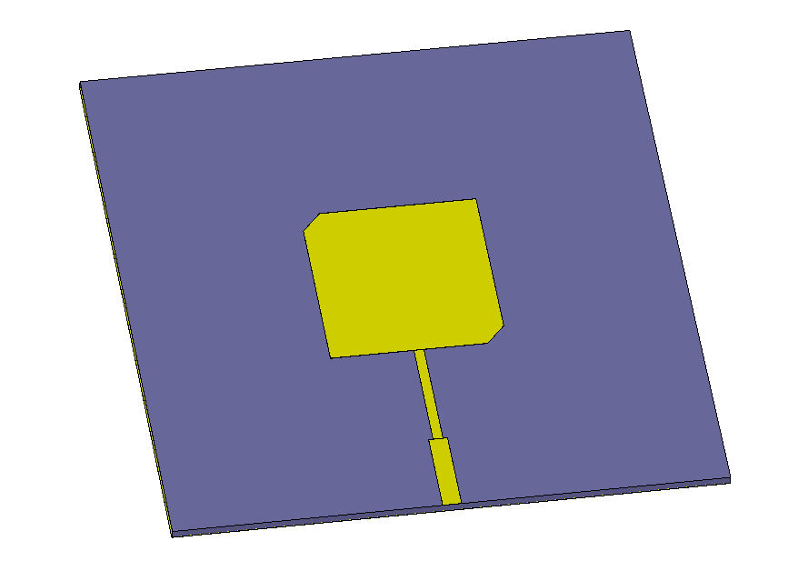
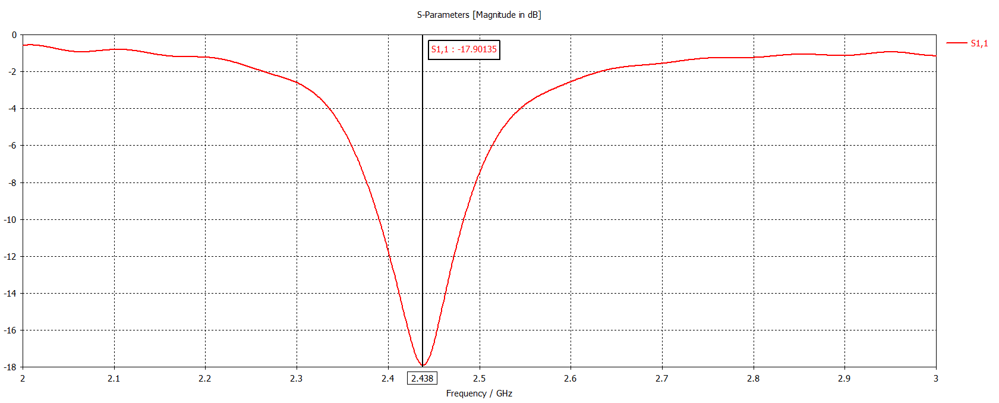

# SquarePatchDesign
A python script to calculate the design parameters of a truncated corners square patch antenna. The antenna is fed with an inset feed. This antenna can produce circularly polarized fields.

